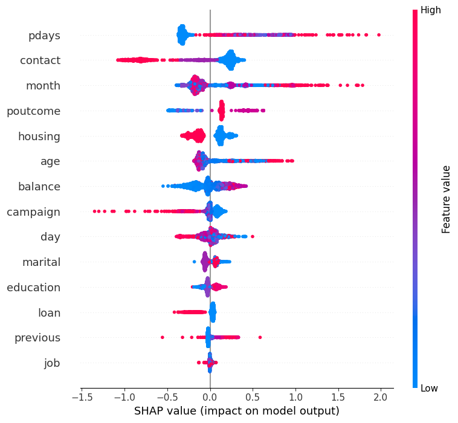
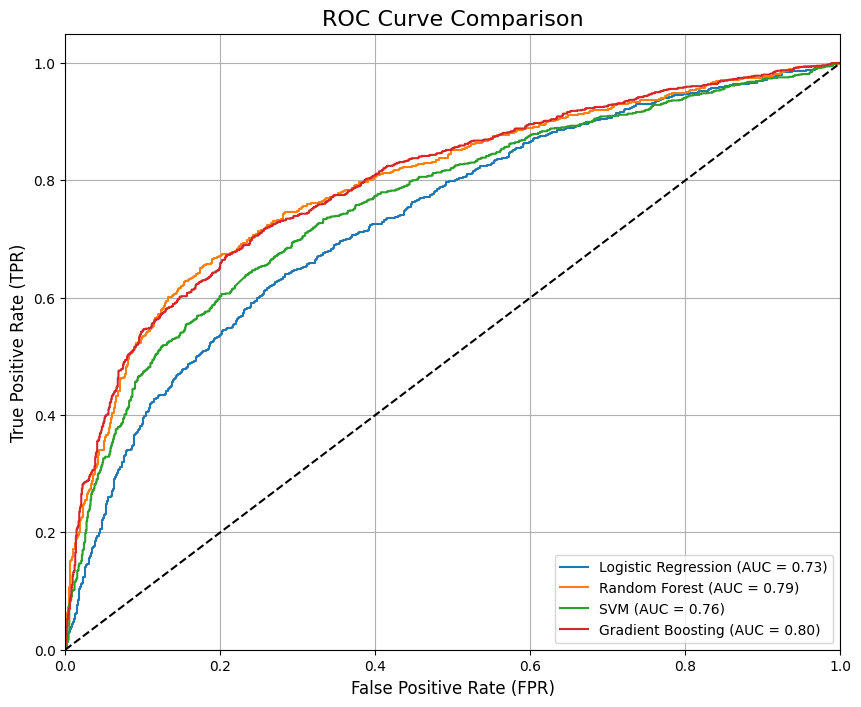

## ML04_BankDataSet

BankDataSet **Machine_Learning**

## How to fork the repository

0. 현재 레포지토리를 포크한다
1. 로컬에 작업할 폴더를 생성
2. 터미널에서 작업폴더를 열고 (혹은 VS Code로 열고)
3. 위 링크로 들어가서 레포지토리를 포크한다
4. 각자 작업할 폴더에서 포크한 자신의 레포지토리 주소를 클론
5. `git clone <your-repo.git> .` 명령어로 클론한다
6. `git remote -v` 로 현재 리모트 저장소를 확인한다
7. `git remote add upstream <original-repo.git>` 으로 원본 레포지토리를 추가한다
8. `git remote -v` 로 현재 리모트 저장소를 확인한다
9. `git pull upstream main` 으로 원본 레포지토리의 내용을 가져온다
10. ??? 작업 한?다???

### Git Rules

🚧🚧🚧🚧🚧🚧🚧🚧🚧🚧🚧🚧🚧🚧🚧🚧🚧🚧🚧🚧🚧🚧🚧🚧🚧🚧🚧🚧🚧🚧🚧🚧🚧🚧🚧🚧🚧🚧🚧🚧

`git pull upstream` 하시면 변경된 README.md가 보이실 것입니다..

→ 수정하면 충돌이 일어나니 README파일은 수정할때 말하기

- 작업은 각자 `깃허브아이디` 명의 폴더를 만들고 그 안에서 합니다
  - 중간중간 각자 깃허브에 PUSH
  - `git add .`
  - `git commit -m <message>`
  - `git push origin`
- 메인 레포 (Upstream) 에 반영하고 싶다면 깃허브 웹페이지에 접속
  - Pull Request를 신청합니다

🚧🚧🚧🚧🚧🚧🚧🚧🚧🚧🚧🚧🚧🚧🚧🚧🚧🚧🚧🚧🚧🚧🚧🚧🚧🚧🚧🚧🚧🚧🚧🚧🚧🚧🚧🚧🚧🚧🚧🚧

> `.ipynb` 파일은 동시 편집을 할 수 없기 때문에,
> 각자가 작업하는 폴더를 분리해서 작업합니다.

- 최종 `merge`는 작업 완료 후 진행합니다.

# 은행 데이터셋을 활용한 머신러닝

## Members

[@euneun9](https://github.com/euneun9)

[@Coke-Eating-Polarbear](https://github.com/Coke-Eating-Polarbear)

[@gaeun19](https://github.com/gaeun19)

[@SukbeomH](https://github.com/SukbeomH)

## 데이터셋

**Example**

```csv
age,job,marital,education,default,balance,housing,loan,contact,day,month,duration,campaign,pdays,previous,poutcome,deposit
59,admin.,married,secondary,no,2343,yes,no,unknown,5,may,1042,1,-1,0,unknown,yes
56,admin.,married,secondary,no,45,no,no,unknown,5,may,1467,1,-1,0,unknown,yes
41,technician,married,secondary,no,1270,yes,no,unknown,5,may,1389,1,-1,0,unknown,yes
55,services,married,secondary,no,2476,yes,no,unknown,5,may,579,1,-1,0,unknown,yes
54,admin.,married,tertiary,no,184,no,no,unknown,5,may,673,2,-1,0,unknown,yes
```

## 데이터셋 정보

- age: 나이
- job: 직업
- marital: 결혼 여부
- education: 교육 수준
- default: 신용 한도 초과 여부
- balance: 연간 평균 잔고
- housing: 주택 대출 여부
- loan: 개인 대출 여부
- contact: 연락 수단
- day: 마지막 연락일
- month: 마지막 연락 월
- duration: 마지막 통화 시간
- campaign: 이번 캠페인 연락 횟수
- pdays: 이전 캠페인 마지막 연락 후 경과 기간
- previous: 이번 캠페인 이전 연락 횟수
- poutcome: 이전 캠페인 성공 여부
- deposit: 예금 장려 여부

## 데이터셋 출처

- [Bank Marketing Data Set(https://archive.ics.uci.edu/ml/datasets/Bank+Marketing)](https://archive.ics.uci.edu/ml/datasets/Bank+Marketing)

## Overview

### 목표

- 은행 데이터셋을 활용해 가장 **Deposit Data**를 잘 예측하는 모델을 선정한다.
- 평가지표는 **AUC**로 한다.

### 전처리

- CSV 파일을 불러와서 데이터프레임으로 변환
- **수치형 데이터** 가공
- **로그** 변환
- **아웃라이어** 처리
- **MinMaxScaler**로 정규화
- 범주형 데이터 **라벨링**

### EDA

- 데이터셋의 전반적인 정보 확인
- **플롯** 확인
- **Describe** 확인

### 모델링

- 모델 선택: (파라미터 조정은 **Grid Search**로 진행)
  - **Random Forest**
  - **Emsamble**
  - **Stacking**
- 변수 선택:
  - Random Forest + Feature Importance
  - PCA + Random Forest



- **Optuna**를 이용하기 위해

  - n_estimators와 max_depth, 최소 샘플 분할, 최소 샘플 범위 설정을 하고
  - 랜덤 포레스트를 돌리는 함수를 제작.
  - AUC를 계산을 하고

- 총 **50번의 objective를 수행**을 하고 그중에서 가장 높은 AUC값을 가지는 파라미터 값을 가지게 하였습니다.

### 평가



- 결과 분석

```json
{
	"Best parameters": {
		"n_estimators": 152,
		"max_depth": 28,
		"min_samples_split": 6,
		"min_samples_leaf": 2
	},
	"Test AUC": 0.8323960187732644
}
```

## 개선 방안

- SHAP 활용

## Trouble Shooting

- 초기에 Duration이 Deposit에 영향을 미치는 것으로 판단하여 제거하지 않았다.
